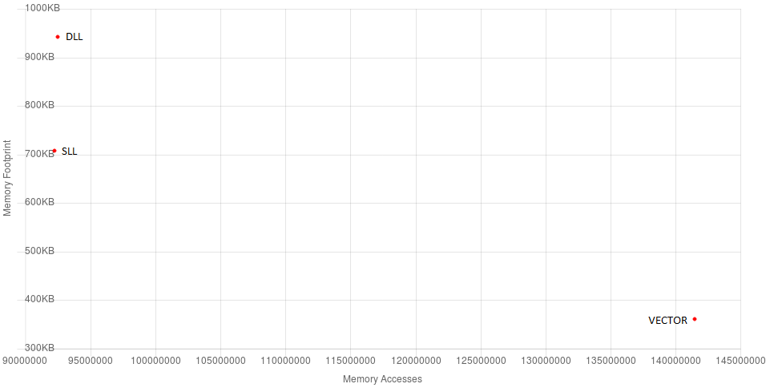

# Σχεδιασμός Ενσωματωμένων Συστημάτων

### Αναφορά 3ης Άσκησης | Βάρδια 1 Ομάδα 2

|                  |          |
| ---------------- | -------- |
| Γρηγόρης Μαντάος | 03113171 |
| Γαβαλάς Νίκος    | 03113121 |

#### Platform Kernel:	`4.9.0-4-amd64`
#### Platform Arch:		`x86_64`
#### GCC Version:		`gcc 5.4.0`

## Άσκηση 1

| Δομή Δεδομένων για τη λίστα των κόμβων | Δομή Δεδομένων για τη λίστα των πακέτων | Memory Accesses | Memory Footprint |
| :------------------------------------: | :-------------------------------------: | :-------------: | :--------------: |
| SLL                                    | SLL                                     | 9390963         | 166.3KB          |
| SLL                                    | DLL                                     | 9468415         | 213.2KB          |
| SLL                                    | VECTOR                                  | 72957665        | 166.4KB          |
| DLL                                    | SLL                                     | 9392361         | 168.5KB          |
| DLL                                    | DLL                                     | 9470043         | 214.8KB          |
| DLL                                    | VECTOR                                  | 72959293        | 168.7KB          |
| VECTOR                                 | SLL                                     | 9485925         | 162.0KB          |
| VECTOR                                 | DLL                                     | 9563607         | 208.4KB          |
| VECTOR                                 | VECTOR                                  | 73032338        | 161.9KB          |


### Σχολιασμός

Παρατηρούμε ότι ο συνδυασμός δομών δεδομένων με τα λιγότερα memory accesses
είναι ο συνδυασμός SLL-SLL (9390963) και ο συνδυασμός με το μικρότερο memory footprint είναι ο συνδυασμός VECTOR-VECTOR (161.9KB).

Για να επιτύχουμε μία "ισορροπία" στην εφαρμογή μας (δηλαδή σχετικά μικρό memory footprint και λίγα memory accesses), θα επιλέγαμε με βάση τη
καμπύλη Pareto (όπως προκύπτει από το άνωθι διάγραμμα) το συνδυασμό VECTOR-SLL,για να βελτιστοποιήσουμε όσο γίνεται τις απαιτήσεις χωρίς μεγάλα tradeoffs.

## Άσκηση 2

Τα αποτελέσματα εκτέλεσης του dijkstra είναι τα ακόλουθα:

```
Shortest path is 1 in cost. Path is:  0 41 45 51 50
Shortest path is 0 in cost. Path is:  1 58 57 20 40 17 65 73 36 46 10 38 41 45 51
Shortest path is 1 in cost. Path is:  2 71 47 79 23 77 1 58 57 20 40 17 52
Shortest path is 2 in cost. Path is:  3 53
Shortest path is 1 in cost. Path is:  4 85 83 58 33 13 19 79 23 77 1 54
Shortest path is 3 in cost. Path is:  5 26 23 77 1 58 99 3 21 70 55
Shortest path is 3 in cost. Path is:  6 42 80 77 1 58 99 3 21 70 55 56
Shortest path is 0 in cost. Path is:  7 17 65 73 36 46 10 58 57
Shortest path is 0 in cost. Path is:  8 37 63 72 46 10 58
Shortest path is 1 in cost. Path is:  9 33 13 19 79 23 77 1 59
Shortest path is 0 in cost. Path is:  10 60
Shortest path is 5 in cost. Path is:  11 22 20 40 17 65 73 36 46 10 29 61
Shortest path is 0 in cost. Path is:  12 37 63 72 46 10 58 99 3 21 70 62
Shortest path is 0 in cost. Path is:  13 19 79 23 77 1 58 99 3 21 70 55 12 37 63
Shortest path is 1 in cost. Path is:  14 38 41 45 51 68 2 71 47 79 23 77 1 58 33 13 92 64
Shortest path is 1 in cost. Path is:  15 13 92 94 11 22 20 40 17 65
Shortest path is 3 in cost. Path is:  16 41 45 51 68 2 71 47 79 23 77 1 58 33 32 66
Shortest path is 0 in cost. Path is:  17 65 73 36 46 10 58 33 13 19 79 23 91 67
Shortest path is 1 in cost. Path is:  18 15 41 45 51 68
Shortest path is 2 in cost. Path is:  19 69
```

Τροποποιώντας τον κώδικα (παρατίθεται στο συμπιεσμένο αρχείο) παίρνουμε
ακριβώς την ίδια έξοδο, επιβεβαιώνοντας ότι οι βιβλιοθήκες έχουν εισαχθεί σωστά.

| Δομή Δεδομένων | Memory Accesses | Memory Footprint |
| :------------: | :-------------: | :--------------: |
| SLL            | 92274254        | 707.7KB          |
| DLL            | 92481266        | 941.8KB          |
| VECTOR         | 141489271       | 360.7KB          |



### Σχολιασμός

Παρατηρούμε ότι λιγότερα memory accesses επιτυγχάνουμε με τη δομή SLL ενώ
μικρότερο memory footprint επιτυγχάνουμε με τη δομή VECTOR.
